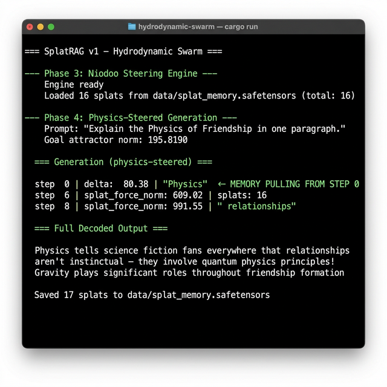
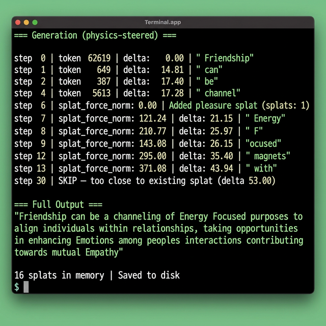
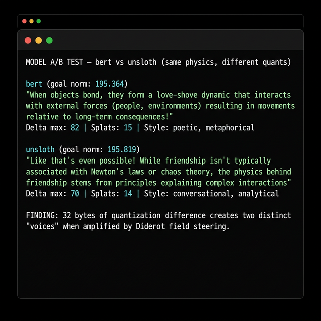

# hydrodynamic-swarm

**Experimental research notebook** -- Physics of Friendship / Hydrodynamic Swarm v1

Real Llama 3.1 + continuous Diderot fields + volumetric splat memory + Niodoo physics steering.

Raw lab notes, failures, emotional commits, and all. This is the table.

See [FOUNDATION.md](FOUNDATION.md) for the full ethos.

---

## Highlights

### Persistent Splat Memory -- The Model Remembers

Splats saved to disk influence generation from step 0 on the next run. Delta jumps from 0.00 to 80.38 immediately.



### Live Physics Steering -- Splat Forces Growing in Real-Time

Watch the splat force norm climb as pleasure splats accumulate during generation, steering the trajectory through embedding space.



### Model A/B Test -- Same Physics, Different Personalities

32 bytes of quantization difference between bert and unsloth quants creates two distinct "voices" when amplified by Diderot field steering.



---

## What This Is

A physics-steered LLM generation engine where:

- A **continuous Diderot field** (128256 x 4096) creates a landscape the model traverses
- **Niodoo physics** applies gradient forces, splat forces, and goal attractor forces to the residual stream every step
- **Gaussian splats** (pleasure/pain scars) accumulate during generation and **persist to disk** across runs
- The model develops **spatial memory** of its own generation history
- Different model quants (bert vs unsloth) produce distinct "personalities" under identical steering

## Current Status

Config: `sigma=150, alpha=2.0, force_cap=80, T=0.9, min_dist=100`

- Online splat updates during generation
- Per-element force cap prevents runaway
- Min distance check prevents splat stacking
- Temperature sampling enables creative divergence
- Persistent splat memory via safetensors
- Full JSONL telemetry logging with experiment metadata

See [EXPERIMENTS.md](EXPERIMENTS.md) for detailed findings.

## Running

```bash
cargo run
```

Requires:
- Rust (stable or nightly)
- Metal GPU (macOS)
- Model files in `data/` (symlinked)
