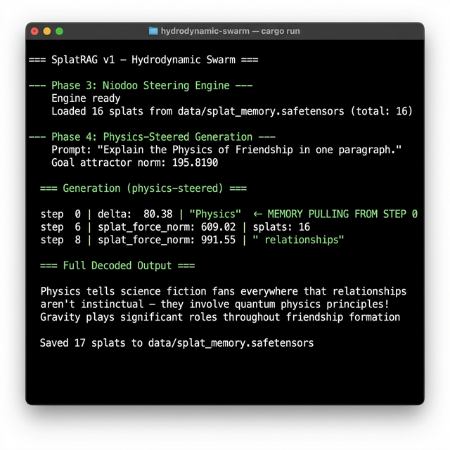
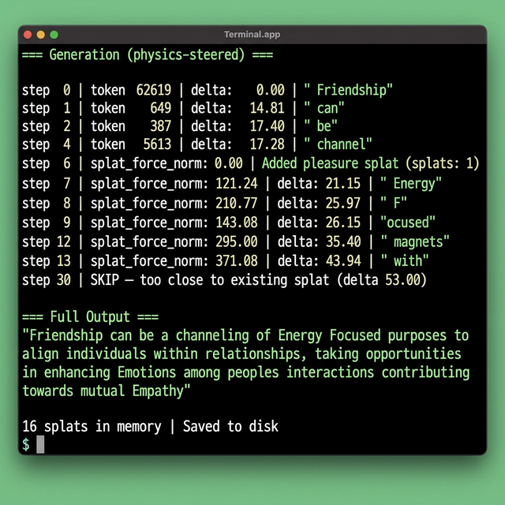
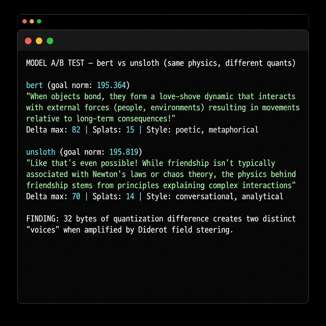

# Hydrodynamic Swarm

A research prototype that steers small-language-model generation with a continuous vector field and a persistent Gaussian-splat memory. The system intervenes in Llama 3.1's residual stream every token to test whether physics-style trajectory control can extend coherence and add persistent state to an 8B model without fine-tuning.

The repository is an experimental notebook, not a product. Code, configs, logs, failed runs, and research notes are all kept in tree so the experiment is reproducible end to end.

## What it does

For each generated token, the system:

1. Runs a vendored quantized Llama 3.1 8B forward pass and reads the pre-`lm_head` hidden state (4096-dim).
2. Computes three forces in that hidden space:
   - **Gradient force** from a continuous "Diderot" field built over the token-embedding matrix (`128256 × 4096`).
   - **Splat force** from a memory of Gaussian splats (position μ, covariance Σ, opacity α) deposited on previous trajectories.
   - **Goal force** from the prompt embedding acting as an attractor.
3. Adds momentum, Langevin noise, and a per-step manifold pullback that keeps the steered vector on the Llama representation manifold.
4. Projects the steered hidden state through `lm_head`, applies a repetition penalty, and samples the next token.
5. Optionally deposits new splats — pleasure for low-surprise tokens, pain for high-surprise tokens — with a minimum-distance check to prevent stacking.

The splat memory is serialized to disk as `safetensors` and reloaded on the next run, so the generator carries spatial memory of its own history across sessions.

## Observed behaviour



Persistent splats reloaded from disk shift the very first token's logits — the per-step delta jumps from 0 to ~80 immediately.



Splat-force norm grows during a single generation as pleasure splats accumulate, steering subsequent tokens through embedding space.



A/B run: two quantizations of the same Llama 3.1 8B weights (≈32 bytes different) diverge into distinct stylistic trajectories under identical physics, suggesting the steering amplifies latent representational differences rather than overriding them.

## Repository layout

```
src/
  main.rs        Entry point, CLI, generation loop, telemetry
  llama.rs       Vendored quantized Llama 3.1 with hidden-state hooks
  field.rs       Continuous Diderot field + gradient probe (Top-K approximation)
  splat.rs       Gaussian splat type and persistence
  memory.rs      Splat memory store, decay, consolidation, query
  niodoo.rs      Steering engine: force composition, manifold pullback
  dream.rs       Micro-dream and offline dream replay
  ridge.rs       Vietoris-Rips H1 reflex (topology-based collapse detector)
  gpu.rs         Candle/CUDA tensor ops and batch field gradient
  tui.rs         Interactive multi-turn chat front end
  viz.rs         JSONL telemetry collector
  config.rs      TOML config loader
docs/
  foundation.md  Architectural design and the core token loop
  experiments.md Tuning sweeps and observed behaviour
  roadmap.md     Phase 2 / Phase 3 plan
research_logs/   Dated notes per substantive change
kernels/         Compute-shader sketches for the wgpu / Metal backend
```

## Status

| | |
|---|---|
| Version | v1.2 — Phase 3 (long-context stabilisation) |
| Base model | Llama 3.1 8B Instruct, Q5\_K\_M GGUF |
| Runtime | Rust 1.75+, Candle 0.9, CUDA 13 |
| Hardware target | NVIDIA Blackwell GB10 (`sm_121a`); any CUDA GPU with ≥8 GB should work |
| Default config | `dt = 0.035`, `viscosity = 0.35`, `force_cap = 7.5`, `manifold_pullback = 0.15`, `T = 0.9` |

Most recent tuning sweep (10 prompts × 120 tokens, default config):

- 7 / 10 prompts coherent through 120 tokens.
- 3 / 10 coherent for 50–90 tokens before gradual drift.
- Persistent splat memory measurably influences token-0 logits on the next run (delta ≈ 80 vs. baseline 0).

See [`docs/experiments.md`](docs/experiments.md) for the raw findings.

## Features in v1.2

- Hidden-state steering on the 4096-dim residual stream (`steer_hidden = true`).
- Per-step manifold pullback against cumulative off-manifold drift.
- Top-K gradient approximation (default `K = 2048`) for tractable field probes.
- Surprise-weighted splat mass (heavy tokens carve deeper scars).
- 8-nearest-neighbour bundle stress as a collective splat force.
- Vietoris-Rips H1 reflex with corrective blend when topology collapses.
- Micro-dream consolidation with hydraulic-jump clamping.
- Offline dream replay of completed trajectories with Langevin noise.
- Online splat creation with min-distance deduplication.
- TOML config for physics, generation, memory, and dream parameters.
- Full per-step JSONL telemetry and a session summary.
- Multi-turn chat TUI with `/quit`, `/exit`, `/reset` commands.

## Running

```bash
# Default run
cargo run --release --bin hydrodynamic-swarm

# Custom prompt
cargo run --release --bin hydrodynamic-swarm -- --prompt "Describe consciousness as a wave function"

# Limit tokens
cargo run --release --bin hydrodynamic-swarm -- --tokens 200

# Fresh start, no persisted splats
cargo run --release --bin hydrodynamic-swarm -- --clear-memory

# Interactive multi-turn chat
cargo run --release --bin hydrodynamic-swarm -- --chat

# Explicit model / tokenizer paths
cargo run --release --bin hydrodynamic-swarm -- \
    --model /path/to/Meta-Llama-3.1-8B-Instruct-Q5_K_M.gguf \
    --tokenizer /path/to/tokenizer.json
```

A wrapper script for the interactive case is at [`scripts/chat.sh`](scripts/chat.sh).

## Configuration

All physics knobs live in a top-level `config.toml`. The defaults are sane; the file is optional.

```toml
[physics]
dt                = 0.035
viscosity_scale   = 0.35
force_cap         = 7.5
splat_sigma       = 35.0
splat_alpha       = 2.0
manifold_pullback = 0.15
steer_hidden      = true
gradient_topk     = 2048

[generation]
max_tokens         = 500
temperature        = 0.9
rep_penalty        = 1.18
min_success_tokens = 15
pleasure_alpha     = 1.8
pain_alpha         = -0.9

[memory]
max_splats         = 500
consolidation_dist = 80.0
decay_rate         = 0.98

[micro_dream]
entropy_threshold  = 3.0
blend_normal       = 0.10
blend_high_entropy = 0.15
topocot_threshold  = 6.0
```

## Requirements

- Rust 1.75+ (stable).
- NVIDIA GPU with the CUDA 13 toolkit (developed on Blackwell GB10).
- Llama 3.1 8B Instruct, GGUF Q5\_K\_M format, plus the matching tokenizer:
  - `Meta-Llama-3.1-8B-Instruct-Q5_K_M.gguf` (~5.7 GB)
  - `tokenizer.json` from the same upstream

Place them in `data/`, or pass `--model` / `--tokenizer` explicitly.

## Testing

```bash
cargo test           # unit tests
cargo clippy         # lint
```

## Scope and limitations

This is a personal research repository, not production software. Coherence beyond ~150 tokens at the default config is not guaranteed, the splat-memory file format will change between versions, and several of the GPU paths still fall back to CPU when CUDA shapes mismatch. The point of keeping it public is documentation: design decisions, failure modes, tuning sweeps, and per-token telemetry are all checked in under `docs/` and `research_logs/` so the experiment is auditable rather than just demonstrated.

## License

MIT. See [`LICENSE`](LICENSE).
